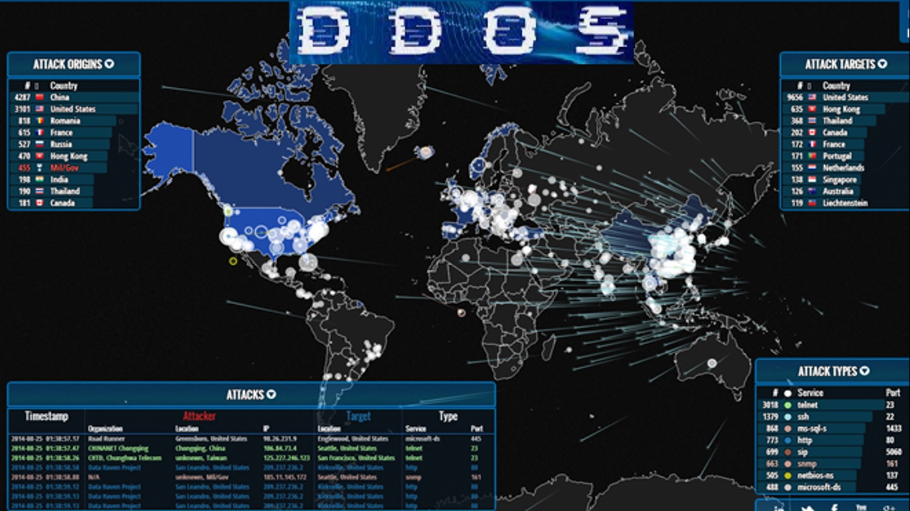
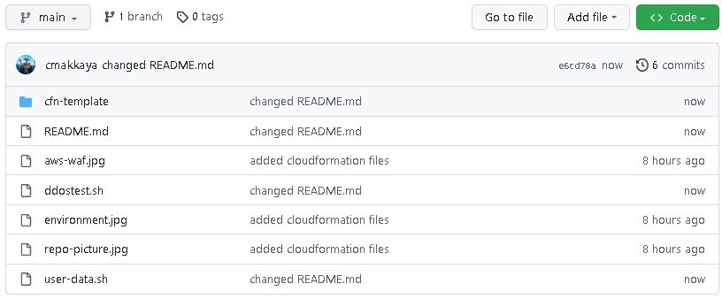
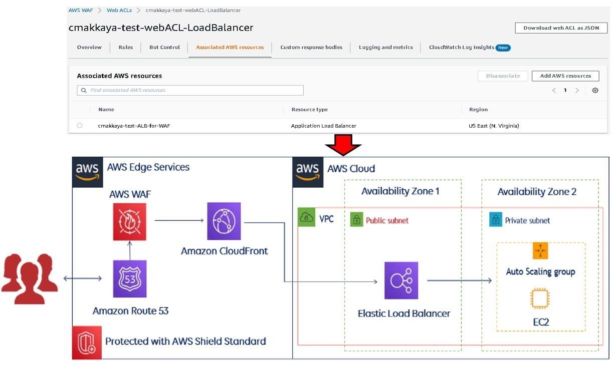

# AWS WAF & Shield


## About The Article

There are codes  and file about article of "How to secure our resources from DDoS attacks with AWS WAF & Shield?". [To see the article of aws-waf.](https://cmakkaya.medium.com/how-to-secure-our-resources-from-doos-attacks-with-aws-waf-shield-5307c85cb476)

In this article, we will learn in detail about WAF, DDoS attacks, and Amazon WAF & Shield.

We will create the necessary environment for WAF test. For this, we will build an Application consisting of Static Web Server (EC2 instance), Load Balancer, Target Group. We will mitigate an application layer DDoS attack on the web server that we build, by defining rules and then by creating rule groups with defined rules and later by associating them to Web ACLs, step by step.

We will create a test script and apply it on our web server that we build. Then, we will examine and analyze the output on AWS WAF dashboard charts and CloudWatch.

Topics we will cover:

1. What is WAF ?

2. AWS WAF & Shield

3. DDoS Attacks

4. How to mitigate DDoS attacks?

5. Mitigating attacks using AWS Shield Standart

5.1. Creating Rule Groups and Rule

5.2. Creating Web ACLs

6. Test to web ACL

6.1. Create a web application

6.2. Build an Application (Static Web Server, ALB, Target Group)

6.2.1. Create an Apache Web Server with a static website at EC2 console

6.2.2. Create a Target group

6.2.3. Create Application Load Balancers (ALB)

7. Control The Application that we created

8. Create the test script

9. Notice the output

10. AWS WAF Dashboard Charts

11. Subscribe to Shield Advanced

12. As a result

13. Next post

14. References

You can build the following environment with cloudformation template to perform the tests mentioned in the article.

## About aws-waf git hub repo

aws-waf repository root folder and terraform template folder contents are below:



## Built With



* Create manually this enviroment above on your cloud provider. For this, follow the commands in item: "6.2. Build an Application (Static Web Servers, ALB, Target Group)" in the article.

* Or build with CloudFormation

This CloudFormation Template creates Application Load Balancer  with ansible loaded with Auto Scaling Group of Amazon Linux 2 (XXXXXXXXXXXXX) EC2 Instances which host Python Flask Web Application. 
EC2 instances are placed within WebServerSecurityGroup which allows http (80) connections only from ALBSecurityGroup, and allows tcp(3306) connections only within itself. RDS DB instance is placed within WebServerSecurityGroup so that Database Server can communicate with Web Servers. Application Load Balancer is placed within ALBSecurityGroup which allows http (80) connections from anywhere. WebServerASG Auto Scaling Group is using the WebServerLT Launch Template in order to spin up instances needed. WebServerLT Launch Template is configured to prepare Python Flask environment on EC2.


### Prerequisites

This deployment can be deployed to an AWS environment. AWS account is required to run this deployment. Use the following link to create an access key and a secret access key.

- [Managing access keys for IAM users](https://docs.aws.amazon.com/IAM/latest/UserGuide/id_credentials_access-keys.html)

Git are reqired for this deployment. 

- To install Git, go to the [Git website](https://git-scm.com/downloads).


### Deployment

### With CloudFormation Template

1. Clone the repo and go to the deployment directory.

```
git clone https://github.com/cmakkaya/aws-waf
cd cfn-template/
```

2. Change your key file path and your key name in cfn-template.yaml file correctly! 

3. Connect to AWS console.  

```
Choose region as us-east-1.
```

```
Choose CloudFormation service
```

```
click on Create stack button
```

```
Choose Template is ready
```

```
Choose Upload a template file
```

```
click on "Choose file"  and then choose cfn-template.yaml in your local host.
```

```
click on Next button
```

```
Enter Stack name whatever you want
```

```
Choose your KeyName
```

```
Choose your MyVPC
```

```
Choose your Subnets
```

```
click on Next button
```

```
There isn't changing in page and click on Next button
```

```
Control the information in page and click on Submit button and wait buildig your environment.
```

4. Follow the commands in the article. 


## Troubleshooting

If the step 3 (Building cloudformation template) fails, see failed code in "Events", you try to correct fail then run templete once again. If it keeps failing save the output logs and reach out to me on Github. 

## Cleanup

8. If the deployment is not needed anymore, run the following command to delete the deployment. Enter yes when prompted.
```
Choose your stack and click on delete stack
```


# Connect with me 📫 You can learn more about me

- 🌐 [LinkedIn](https://www.linkedin.com/in/cumhurakkaya/)
- 🌐 [GitHub](https://github.com/cmakkaya/)
- 🌐 [GitLab](https://gitlab.com/cmakkaya)
- ✏️ [Medium Articles](https://cmakkaya.medium.com/)
- ✏️ [Wordpress Articles](https://cloudplatformsanddevops.wordpress.com/)
- 🏢 [Portfolio/Resume Page](https://portfolio.cmakkaya-awsdevops.link/)
- 📺 [YouTube](https://www.youtube.com/channel/UCWcRIvy70tBBfrmBocDR5hA)


# References for article

- 1) https://www.oracle.com/tr/security/cloud-security/what-is-waf/

- 2) https://www.edureka.co/blog/secure-web-applications-with-aws-waf/

- 3) https://docs.aws.amazon.com/waf/latest/APIReference/Welcome.html

- 4) https://k21academy.com/amazon-web-services/aws-shield/

- 5) https://medium.com/awesome-cloud/aws-waf-web-application-firewall-overview-what-is-aws-waf-introduction-to-aws-web-application-firewall-6247a8a0283d

- 6) https://docs.aws.amazon.com/whitepapers/latest/guidelines-for-implementing-aws-waf/understanding-threats-and-mitigations.html

- 7) https://docs.aws.amazon.com/whitepapers/latest/guidelines-for-implementing-aws-waf/guidelines-for-implementing-aws-waf.html

- 8) https://aws.amazon.com/waf/pricing/?nc2=type_a

- 9) AWS 2021 — AWS Shield: Automated layer 7 DDoS mitigation https://www.youtube.com/watch?v=T3kqljTLR50

- 10) https://aws.amazon.com/tr/blogs/aws/aws-shield-protect-your-applications-from-ddos-attacks/

- 11) Chapter 6. Fundamental Cloud Security, Page:9. https://dokumen.tips/documents/chapter-6-fundamental-cloud-chapter-6-fundamental-cloud-security-61-basic-terms.html?page=9

- 12) https://docs.aws.amazon.com/waf/latest/developerguide/ddos-responding.html

- 13) https://adrien-mornet.tech/how-to-protect-a-website-against-dos-attack-using-aws-waf-v2/